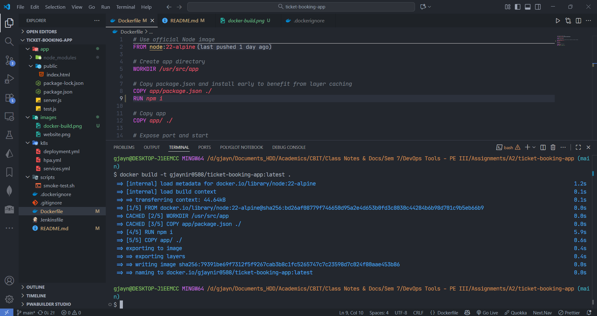
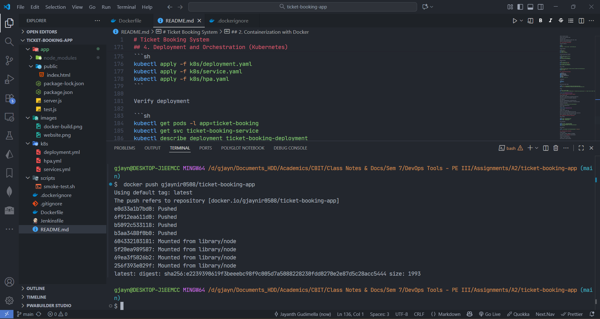
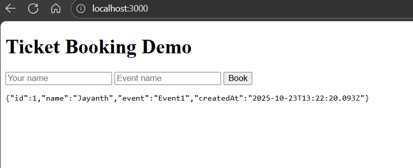
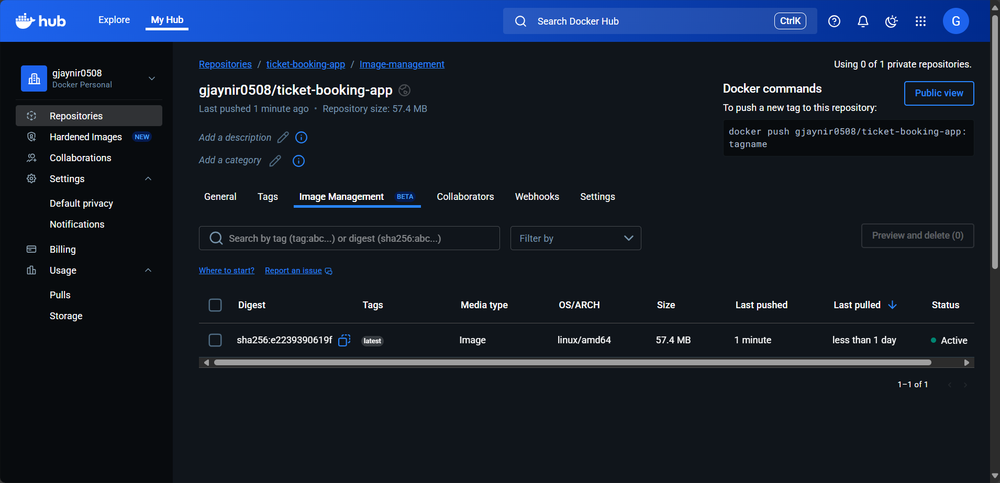

# Ticket Booking System

DevOps Tools Assignment 2 - Ticket Booking System
Submitted By - Jayanth Gudimella (160122771041 - AI&DS 1 I1 Sem 7)

```sh
ticket-booking-app/
├─ app/
│  ├─ server.js
│  ├─ package.json
│  └─ public/
│      └─ index.html
├─ Dockerfile
├─ .dockerignore
├─ Jenkinsfile
├─ README.md
├─ k8s/
│  ├─ deployment.yaml
│  ├─ service.yaml
│  └─ hpa.yaml
└─ scripts/
   └─ smoke-test.sh
```

## 📘 Overview

This repository demonstrates a complete automated DevOps workflow for a simple web-based ticket booking application using the following tools:

Git + GitFlow → Version control and branching strategy

Docker → Containerization of the web app

Jenkins → Continuous Integration and Continuous Delivery (CI/CD)

Docker Hub → Image registry

Kubernetes → Deployment and orchestration

The goal is to implement a fully automated workflow covering version control, containerization, CI/CD, and orchestration.

## ⚙️ Prerequisites

Git and GitFlow extension (optional)

Docker (installed locally)

Jenkins server with Docker access

Docker Hub account

Kubernetes cluster (Minikube, Kind, EKS, AKS, or GKE)

kubectl CLI installed and configured

## 1. Version Control and Branching

Initialize repository

```sh
git init
git add .
git commit -m "Initial commit - ticket booking app"
```

GitFlow branching

```sh
git flow init -d
# or manually:
git branch -M main
git checkout -b develop
```

Create and merge feature branches

```sh
git flow feature start booking-ui
# develop your feature
git add .
git commit -m "feat: booking UI"
git flow feature finish booking-ui
```

Release and hotfix

```sh
git flow release start 1.0.0
git flow release finish 1.0.0

git flow hotfix start urgent-fix
git flow hotfix finish urgent-fix
```

Push to GitHub

```sh
git remote add origin https://github.com/<your-username>/ticket-booking-app.git
git push -u origin --all
git push --tags
```

## 2. Containerization with Docker

```Dockerfile
FROM node:18-alpine
WORKDIR /usr/src/app
COPY app/package.json ./
RUN npm ci --only=production
COPY app/ ./
EXPOSE 3000
CMD ["node", "server.js"]
```

.dockerignore

```sh
node_modules
npm-debug.log
.git
```

Build and test Docker image

```sh
docker build -t your-dockerhub-username/ticket-booking-app:latest .
docker run --rm -p 3000:3000 your-dockerhub-username/ticket-booking-app:latest
```

Verify

```sh
curl http://localhost:3000/
curl -X POST http://localhost:3000/api/book -H "Content-Type: application/json" -d '{"name":"Alice","event":"Concert"}'
```




## 3. Continuous Integration & Delivery (Jenkins)

Jenkins pipeline setup

Open Jenkins → Create Pipeline or Multibranch Pipeline job.

Connect your GitHub repo (use SSH/HTTPS credentials).

Add credentials:

Docker Hub: Username/Password → ID dockerhub-cred-id

Kubernetes: Secret file with kubeconfig → ID kubeconfig-cred-id

Configure GitHub Webhook

Payload URL: `http://<jenkins-server>/github-webhook/`

Content type: application/json

Events: “Push”



Pipeline stages

Checkout → Pulls latest code

Build & Test → Installs dependencies and runs tests

Build & Push Docker Image → Builds and pushes image to Docker Hub

Deploy to Kubernetes → Applies manifests to cluster



## 4. Deployment and Orchestration (Kubernetes)

Deploy commands

```sh
kubectl apply -f k8s/deployment.yaml
kubectl apply -f k8s/service.yaml
kubectl apply -f k8s/hpa.yaml
```

Verify deployment

```sh
kubectl get pods -l app=ticket-booking
kubectl get svc ticket-booking-service
kubectl describe deployment ticket-booking-deployment
kubectl get hpa
```

Scale manually

```sh
kubectl scale deployment ticket-booking-deployment --replicas=5
```

## 5. GitHub and Jenkins Integration

Configure webhook

Go to GitHub → Settings → Webhooks → Add Webhook

Payload URL: http://<JENKINS_HOST>/github-webhook/

Content type: application/json

Trigger on: “Just the push event”

Verify delivery: should show 200 OK
